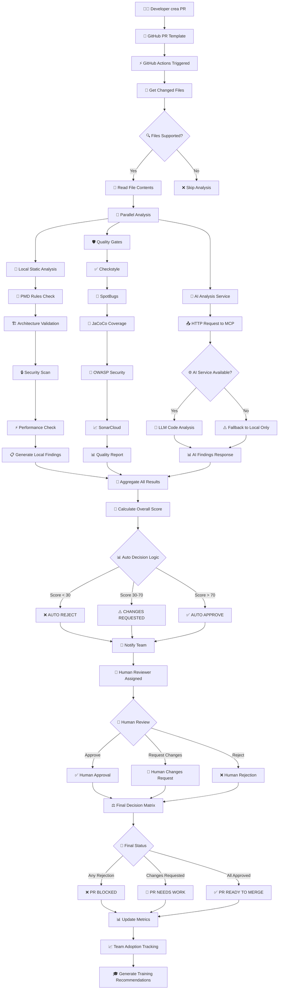
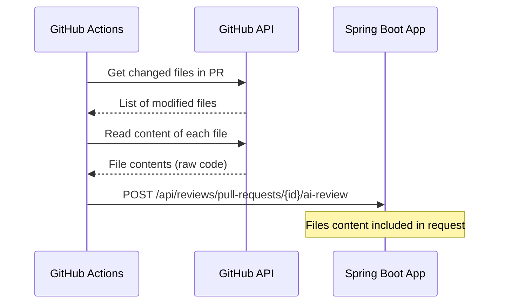
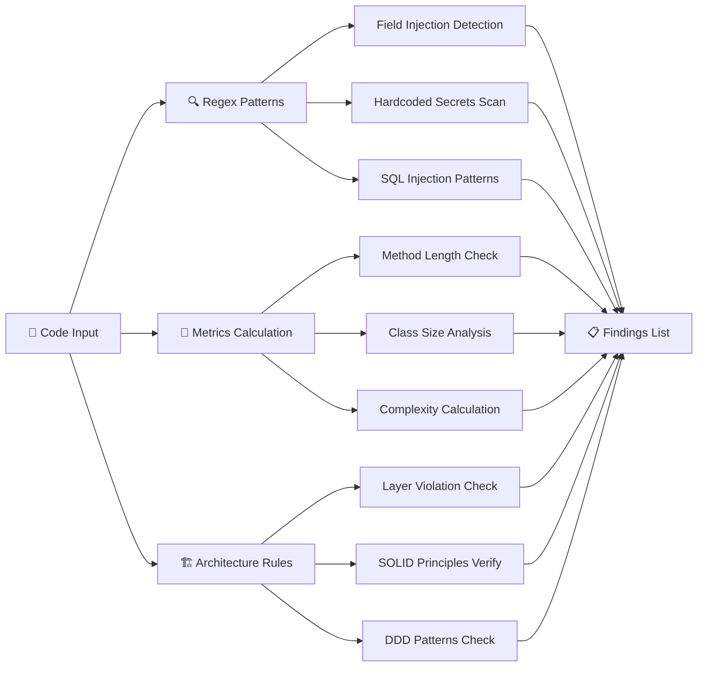
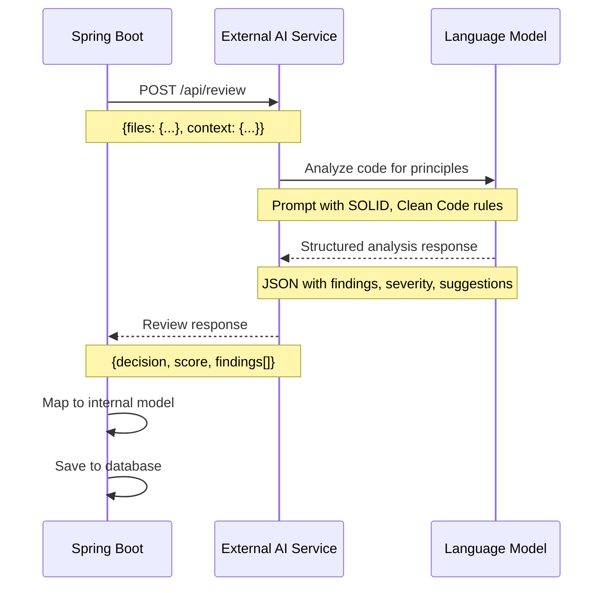
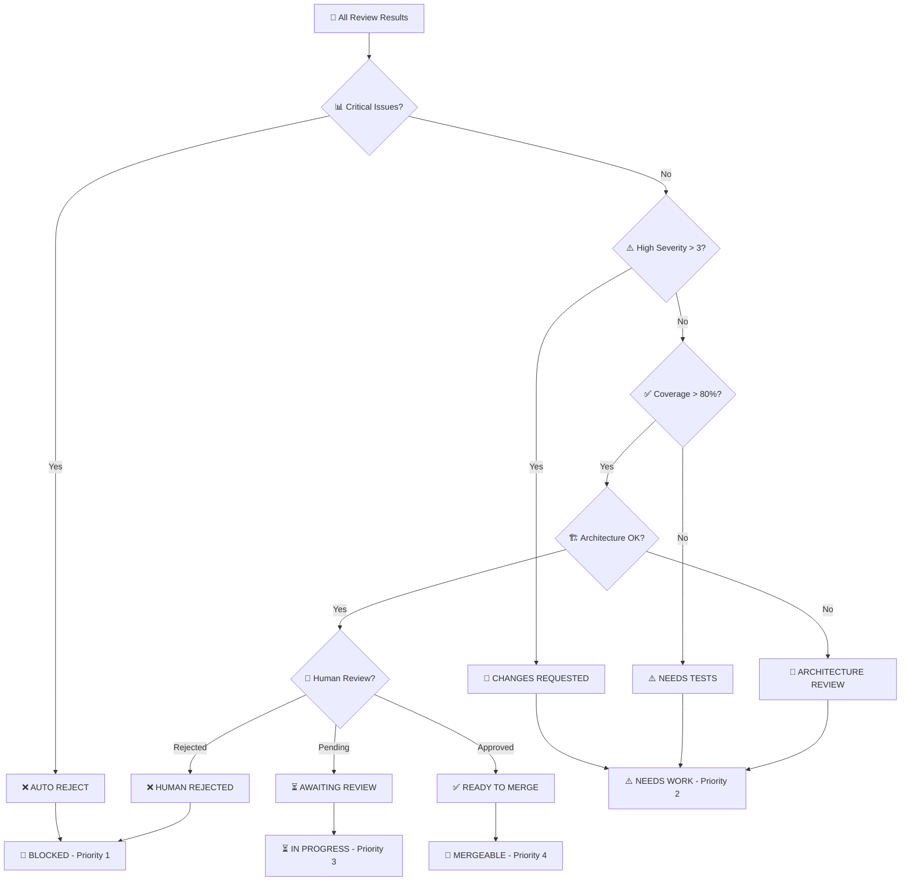
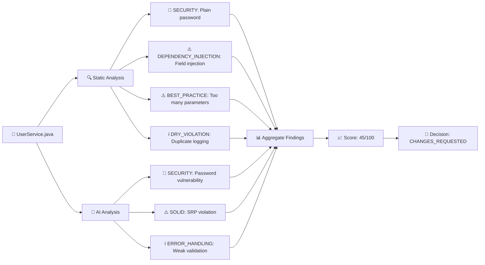
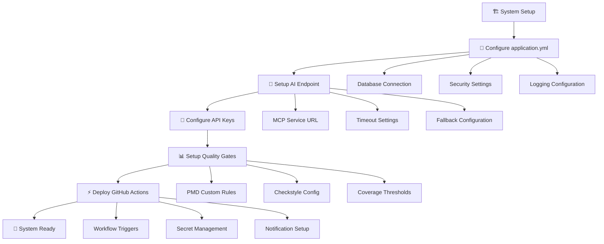

# 🔄 Diagramma di Funzionamento - AI Code Review System

## 📊 **Flusso Completo del Sistema**



## 🔧 **Dettaglio Componenti Tecnici**

### 1. **📂 File Detection & Content Reading**


### 2. **🤖 Local Static Analysis Engine**


### 3. **🧠 AI Service Integration**


## 📊 **Decision Matrix Logic**



## 🔧 **Esempio Pratico di Analisi**

### **Input: Codice Java**
```java
@Service
public class UserService {
    @Autowired  // ⚠️ Field injection
    private UserRepository userRepository;
    
    public User createUser(String name, String email, String password) {  // ⚠️ Troppi parametri
        if (name == null) return null;  // ⚠️ Null check debole
        
        User user = new User();
        user.setPassword(password);  // 🚨 Password in chiaro!
        userRepository.save(user);
        
        // ⚠️ Metodo troppo lungo, duplicazione logica
        System.out.println("User created: " + name);
        log.info("User created: " + name);
        
        return user;
    }
}
```

### **Output: Findings Generati**


## 🎯 **Configurazione e Deployment**



Questo diagramma mostra l'**intero ecosistema** di come il sistema analizza il codice, combina risultati automatici e AI, e prende decisioni intelligenti per il code review! 🚀