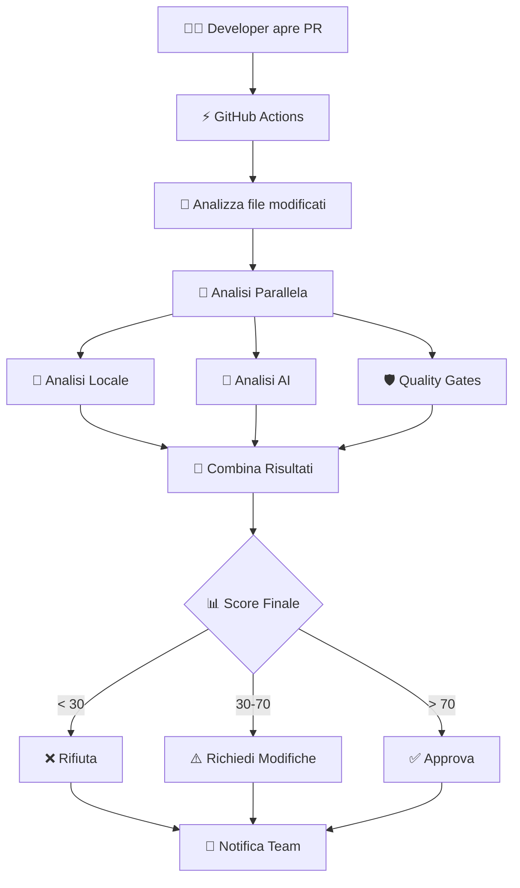

# 🔄 Diagramma Semplificato - AI Code Review System

## 📊 **Flusso Principale del Sistema**

## 🧩 **Componenti Principali**

1. **🤖 Analisi Locale**: PMD, Checkstyle, Security scan
2. **🧠 Analisi AI**: LLM per principi SOLID e Clean Code
3. **🛡️ Quality Gates**: Coverage, SonarCloud, OWASP
4. **📊 Decision Engine**: Calcola score e decide automaticamente

## 💡 **In Sintesi**

Il sistema prende una PR, la analizza con 3 motori diversi, combina i risultati e decide automaticamente se approvarla, richiedere modifiche o rifiutarla basandosi su uno score calcolato.